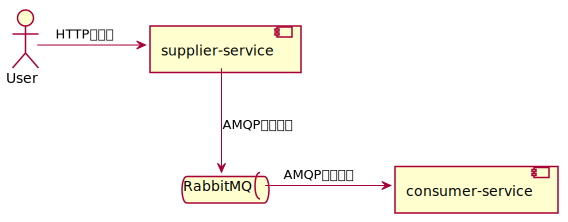
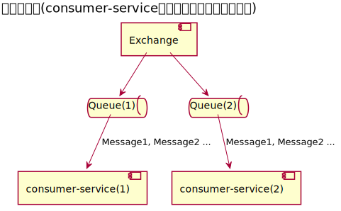
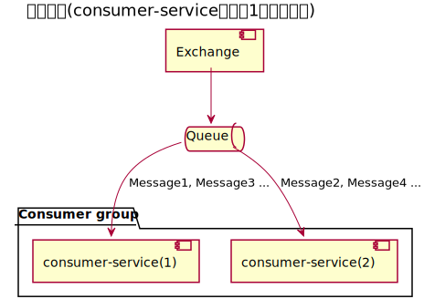
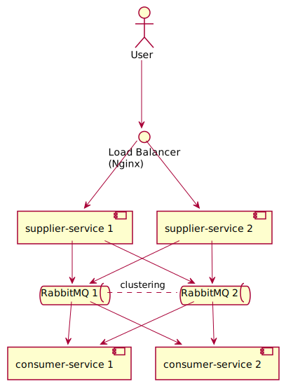

# Spring Cloud Stream

<!-- @import "[TOC]" {cmd="toc" depthFrom=1 depthTo=6 orderedList=false} -->

<!-- code_chunk_output -->

- [Spring Cloud Stream](#spring-cloud-stream)
  - [Spring Cloud Streamとは](#spring-cloud-streamとは)
  - [デモ](#デモ)
    - [必要なもの](#必要なもの)
    - [RabbitMQを起動する](#rabbitmqを起動する)
    - [メッセージ送信側アプリケーションを起動する](#メッセージ送信側アプリケーションを起動する)
    - [メッセージ受信側アプリケーションを起動する](#メッセージ受信側アプリケーションを起動する)
    - [メッセージを送信する](#メッセージを送信する)
    - [エラーハンドリング](#エラーハンドリング)
    - [後始末](#後始末)
  - [冗長化デモ](#冗長化デモ)
    - [連続でリクエストを投げながら色々止めたりしながら遊ぼう](#連続でリクエストを投げながら色々止めたりしながら遊ぼう)
    - [後始末](#後始末-1)

<!-- /code_chunk_output -->

## Spring Cloud Streamとは

公式ウェブサイトには次のように書かれています。

> Spring Cloud Stream is a framework for building highly scalable event-driven microservices connected with shared messaging systems.

> Spring Cloud Streamは共有されたメッセージングシステムに接続された高度にスケーラブルなイベント駆動型のマイクロサービスを構築するためのフレームワークです。

Spring Cloud Streamは[Spring Integration](https://spring.io/projects/spring-integration)上に構築されています。
Spring IntegrationはMQやデータベース、Redis、Web API、ローカルのファイルなど様々な外部環境をアプリケーションと繋げられるフレームワークです。

Spring Cloud Streamが受け取ったメッセージを処理するために[Spring Cloud Function](https://spring.io/projects/spring-cloud-function)が使われています。
Spring Cloud FunctionはWebやメッセージングといった外部との境界部分の詳細を切り離して関数を通してビジネスロジックに集中できることを目指しているフレームワークです。
また、各クラウドベンダーのサーバーレスでも使えること(そしてスタンドアローンでも実行できること)を目指しています。

## デモ

Spring Cloud Streamで2つのサービスを繋ぐとてもシンプルなデモを用意しています。
メッセージングにはRabbitMQを用います。

デモアプリケーションの処理の流れは次の通りです。

1. ユーザーが`supplier-service`へHTTPでテキストを送信する
2. `supplier-service`は受け取ったテキストをRabbitMQへ送信する
3. `consumer-service`はRabbitMQから受信したテキストを標準出力へ書き出す



### 必要なもの

- Java 11
- Docker
- curl

### RabbitMQを起動する

まずDockerでRabbitMQを起動します。

- https://hub.docker.com/_/rabbitmq

今回は管理画面が見られる`-management`が付いているバージョンを使用します。

```sh
docker run -d --name mq -p 5672:5672 -p 15672:15672 rabbitmq:3-management
```

ポート`5672`がMQ(AMQP)、`15672`が管理画面(HTTP)です。

次のURLで管理画面を開けます。

- http://localhost:15672/

ユーザー名・パスワードはデフォルトではどちらも`guest`です。

### メッセージ送信側アプリケーションを起動する

HTTPで受け取ったテキストで`Tweet`を構築してキューへ送信するアプリケーションを起動します。

```sh
cd services/supplier-service
./mvnw spring-boot:run
```

### メッセージ受信側アプリケーションを起動する

キューから受信した`Tweet`を標準出力へ書き出すアプリケーションを起動します。

```sh
cd services/consumer-service
./mvnw spring-boot:run
```

### メッセージを送信する

アプリケーションが起動したら`supplier-service`へHTTPで`content`を送ります。

```sh
curl localhost:8080 -H "Content-Type: application/json" -d '{"content":"Hello World"}'
```

そうすると、[SupplierController](services/supplier-service/src/main/java/com/example/SupplierController.java)がHTTPリクエストを受け取って`tweet`という名前のExchangeへメッセージを送信します。

ここで送信先となるExchangeは`StreamBridge#send`の第1引数によって指定されています。

Exchangeへ送信されたメッセージはバインドされているキューへ送信されます。

なお、ここで書いているようにメッセージは直接キューに入るわけではなく、まずExchangeに渡されます。
Exchangeは設定に応じて適したキューへメッセージをルーティングします。
アプリケーションはキューをサブスクライブしており、ルーティングされたメッセージを受け取るといった流れになっています。

- 参考：https://www.rabbitmq.com/tutorials/amqp-concepts.html#amqp-model

キューはデフォルトだと`consumer-service`のインスタンス毎に1つ用意されますが、グループが設定されている場合はグループ毎に1つ用意されます。





グループは`spring.cloud.stream.bindings.<bindingName>.group`の値で設定できます。

`consumer-service`はキューからメッセージを受信し、[ConsumerFunction](services/consumer-service/src/main/java/com/example/ConsumerFunction.java)で定義された`tweet`関数へメッセージが渡され、標準出力に書き出されます。

### エラーハンドリング

DLQ(Dead Letter Queue)という仕組みを使ってエラーが発生したメッセージを専用のキューにエンキューできます。
エラーハンドリングはDLQをサブスクライブすることで行えます。

次の`curl`コマンドで不正なメッセージを送信してみる(JSONになっていない)。

```sh
curl localhost:8080 -H "Content-Type: text/plain" -d 'Invalid message'
```

すると`consumer-service`側で例外がスローされてメッセージは`tweet.myGroup.dlq`というキューにエンキューされます。
今回はアプリケーション側でDLQをサブスクライブしていないためRabbitMQの管理画面で該当のキューからGet Messageをして確認します。

### 後始末

`supplier-service`と`consumer-service`を停止してください(`ctrl + c`)。

それからRabbitMQを破棄します。

```sh
docker rm -f mq
```

## 冗長化デモ

RabbitMQクラスタを構築してSpring Cloud Streamを試してみましょう。



まずアプリケーションのコンテナイメージをビルドします。

```sh
for pj in $(ls services); do cd services/$pj && \
./mvnw -Ptracing -DskipTests spring-boot:build-image && \
cd ../..; \
done
```

次にDocker ComposeでRabbitMQ、アプリケーション(`supplier-service`と`consumer-service`をそれぞれ2つずつ)、ロードバランサー(Nginx)を起動します。

```sh
docker compose up -d
```

サービスの起動には少し時間がかかります。

サービスの標準出力に書き出されるログで動作確認するためログを表示しておきます。

```sh
docker compose logs -f --since 0s \
  supplier-service1 supplier-service2 \
  consumer-service1 consumer-service2
```

サービスが起動したらロードバランサーを経由して`supplier-service`へHTTPで`content`を送ります。

```sh
curl -s localhost:8080 -H "Content-Type: application/json" -d '{"content":"Hello World"}'
```

### 連続でリクエストを投げながら色々止めたりしながら遊ぼう

次のコマンドで連続でリクエスト投げっぱなしにします。

```sh
for i in {1..10000}; do \
  curl -s localhost:8080 -H "Content-Type: application/json" -d '{"content":"My tweet '$(printf "%05d" "$i")'"}' && \
  sleep 1; \
done
```

それからアプリケーションやRabbitMQを止めたり起動したりしてみましょう(`docker compose stop/docker compose start`)。

### 後始末

Docker Composeを落とします。

```
docker compose down -v
```

コンテナイメージを破棄します。

```
docker rmi supplier-service:0.0.1-SNAPSHOT consumer-service:0.0.1-SNAPSHOT
```
