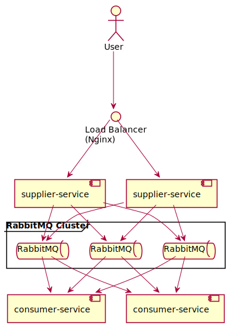

# Spring Cloud Stream

<!-- @import "[TOC]" {cmd="toc" depthFrom=1 depthTo=6 orderedList=false} -->

<!-- code_chunk_output -->

- [Spring Cloud Stream](#spring-cloud-stream)
  - [Spring Cloud Streamとは](#spring-cloud-streamとは)
  - [デモ](#デモ)
    - [必要なもの](#必要なもの)
    - [RabbitMQを起動する](#rabbitmqを起動する)
    - [メッセージ送信側アプリケーションを起動する](#メッセージ送信側アプリケーションを起動する)
    - [メッセージ受信側アプリケーションを起動する](#メッセージ受信側アプリケーションを起動する)
    - [メッセージを送信する](#メッセージを送信する)
    - [エラーハンドリング](#エラーハンドリング)
    - [後始末](#後始末)
  - [冗長化デモ](#冗長化デモ)
    - [連続でリクエストを投げながら色々止めたりしながら遊ぼう](#連続でリクエストを投げながら色々止めたりしながら遊ぼう)
    - [後始末](#後始末-1)

<!-- /code_chunk_output -->

## Spring Cloud Streamとは

> Spring Cloud Stream is a framework for building highly scalable event-driven microservices connected with shared messaging systems.

共有されたメッセージングシステムに接続された高度にスケーラブルなイベント駆動型のマイクロサービスを構築するためのフレームワーク。

Spring Cloud Streamは[Spring Integration](https://spring.io/projects/spring-integration)上に構築されている。
Spring IntegrationはMQやデータベース、Redis、Web API、ローカルのファイルなど様々な外部環境をアプリケーションと繋げられるフレームワーク。

Spring Cloud Streamが受け取ったメッセージを処理するのには[Spring Cloud Function](https://spring.io/projects/spring-cloud-function)が使われている。
Spring Cloud FunctionはWebやメッセージングといった外部との境界部分の詳細を切り離して関数を通してビジネスロジックに集中できることを目指しているフレームワーク。
各クラウドベンダーのサーバーレスでも使えること(そしてスタンドアローンでも実行できること)を目指している。

## デモ

Spring Cloud Streamで2つのサービスを繋ぐとてもシンプルなデモ。
メッセージングにはRabbitMQを用いる。

ユーザーが`supplier-service`へHTTPでテキストを送信する。
`supplier-service`は受け取ったテキストをRabbitMQへエンキューする。
`consumer-service`はRabbitMQからテキストを受け取って標準出力へ書き出す。


### 必要なもの

- Java 11
- Docker
- curl

### RabbitMQを起動する

DockerでRabbitMQを起動する。

- https://hub.docker.com/_/rabbitmq

管理画面が見られる`-management`が付いているバージョンを使用する。

```sh
docker run -d --name mq -p 5672:5672 -p 15672:15672 rabbitmq:3-management
```

ポート`5672`がMQ(AMQP)、`15672`が管理画面(HTTP)。

次のURLで管理画面を開ける。

- http://localhost:15672/

ユーザー名・パスワードはデフォルトだとどちらも`guest`。

### メッセージ送信側アプリケーションを起動する

HTTPで受け取ったテキストで`Tweet`を構築してキューへ送信するアプリケーション。

```sh
cd supplier-service
./mvnw spring-boot:run
```

### メッセージ受信側アプリケーションを起動する

キューから受信した`Tweet`を標準出力へ書き出すアプリケーション。

```sh
cd consumer-service
./mvnw spring-boot:run
```

### メッセージを送信する

`supplier-service`へHTTPで`content`を送る。

```sh
curl localhost:8080 -H "Content-Type: application/json" -d '{"content":"Hello World"}'
```

そうすると、`SupplierController#handleTweet`がHTTPリクエストを受け取って`tweet`という名前のExchangeへメッセージを送信する。

ここで送信先となるExchangeは`StreamBridge#send`の第1引数によって指定される。

Exchangeへ送信されたメッセージはバインドされているキューへ送信される。

なお、ここで書いているようにメッセージは直接キューに入るわけではなく、まずExchangeに渡される。
Exchangeは設定に応じて適したキューへメッセージをルーティングする。
アプリケーションはキューをサブスクライブしており、ルーティングされたメッセージを受け取る。

- 参考：https://www.rabbitmq.com/tutorials/amqp-concepts.html#amqp-model

キューはデフォルトだと`consumer-service`のインスタンス毎に1つ用意されるが、グループが設定されている場合はグループ毎に1つ用意される。
グループは`spring.cloud.stream.bindings.<bindingName>.group`の値で設定される。

`consumer-service`はキューからメッセージを受信し、`ConsumerFunction`で定義された`tweet`関数へメッセージが渡され、標準出力に書き出される。

### エラーハンドリング

DLQ(Dead Letter Queue)という仕組みを使ってエラーが発生したメッセージを専用のキューにエンキューできる。

次の`curl`コマンドで不正なメッセージを送信してみる。

```sh
curl localhost:8080 -H "Content-Type: text/plain" -d 'Invalid message'
```

すると`consumer-service`側で例外がスローされてメッセージは`tweet.myGroup.dlq`というキューにエンキューされる。
RabbitMQの管理画面で該当のキューを選択してGet Messageをしてみるとそれが確認できる。

### 後始末

`supplier-service`と`consumer-service`を停止させる。

それからRabbitMQを破棄する。

```sh
docker rm -f mq
```

## 冗長化デモ

RabbitMQクラスタを構築してSpring Cloud Streamを試してみる。



まずアプリケーションのコンテナイメージをビルドする。

```sh
for pj in supplier-service consumer-service; do cd $pj && ./mvnw -Ptracing,actuator -DskipTests spring-boot:build-image && cd ..; done
```

次にDocker ComposeでRabbitMQ、アプリケーション、ロードバランサー(Nginx)を起動する。

```sh
docker compose up -d
```

サービスの起動には少し時間がかかる。

サービスの標準出力に書き出されるログで動作確認するためログを表示しておく。

```sh
docker compose logs -f --since 0s supplier-service1 supplier-service2 consumer-service1 consumer-service2
```

サービスが起動したらロードバランサーを経由して`supplier-service`へHTTPで`content`を送る。

```sh
curl -s localhost:8080 -H "Content-Type: application/json" -d '{"content":"Hello World"}'
```

### 連続でリクエストを投げながら色々止めたりしながら遊ぼう

連続でリクエスト投げる。

```sh
for i in {1..10000}; do \
  curl -s localhost:8080 -H "Content-Type: application/json" -d '{"content":"My tweet '$(printf "%05d" "$i")'"}' && \
  sleep 1; \
done
```

### 後始末

Docker Composeを落とす。

```
docker compose down
```

コンテナイメージを破棄する。

```
docker rmi supplier-service:0.0.1-SNAPSHOT consumer-service:0.0.1-SNAPSHOT
```
