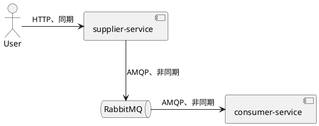
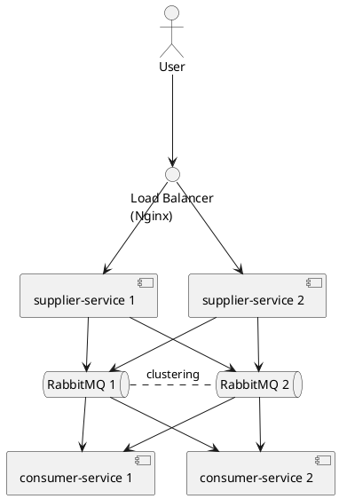
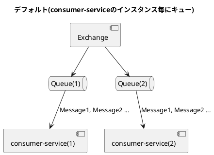
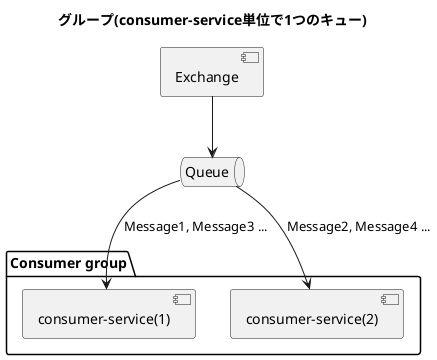

```plantuml
@startuml diagram1

actor User as user
component "supplier-service" as ss
component "consumer-service" as cs
queue RabbitMQ as mq

user -> ss : HTTP、同期
ss --> mq : AMQP、非同期
mq -> cs : AMQP、非同期

@enduml
```

```plantuml
@startuml diagram2

actor User as user
circle "Load Balancer\n(Nginx)" as lb
component "supplier-service 1" as ss1
component "supplier-service 2" as ss2
queue "RabbitMQ 1" as mq1
queue "RabbitMQ 2" as mq2
component "consumer-service 1" as cs1
component "consumer-service 2" as cs2

user --> lb

lb --> ss1
lb --> ss2

ss1 --> mq1
ss1 --> mq2
ss2 --> mq1
ss2 --> mq2

mq1 . mq2 : clustering

mq1 --> cs1
mq1 --> cs2
mq2 --> cs1
mq2 --> cs2

@enduml
```

```plantuml
@startuml default
title デフォルト(consumer-serviceのインスタンス毎にキュー)

component Exchange as ex
queue "Queue(1)" as q1
queue "Queue(2)" as q2
component "consumer-service(1)" as cs1
component "consumer-service(2)" as cs2

ex --> q1
ex --> q2
q1 --> cs1 : Message1, Message2 ...
q2 --> cs2 : Message1, Message2 ...

@enduml
```

```plantuml
@startuml group
title グループ(consumer-service単位で1つのキュー)

component Exchange as ex
queue Queue as q1
package "Consumer group" {
    component "consumer-service(1)" as cs1
    component "consumer-service(2)" as cs2
}

ex --> q1
q1 --> cs1 : Message1, Message3 ...
q1 --> cs2 : Message2, Message4 ...

@enduml
```
